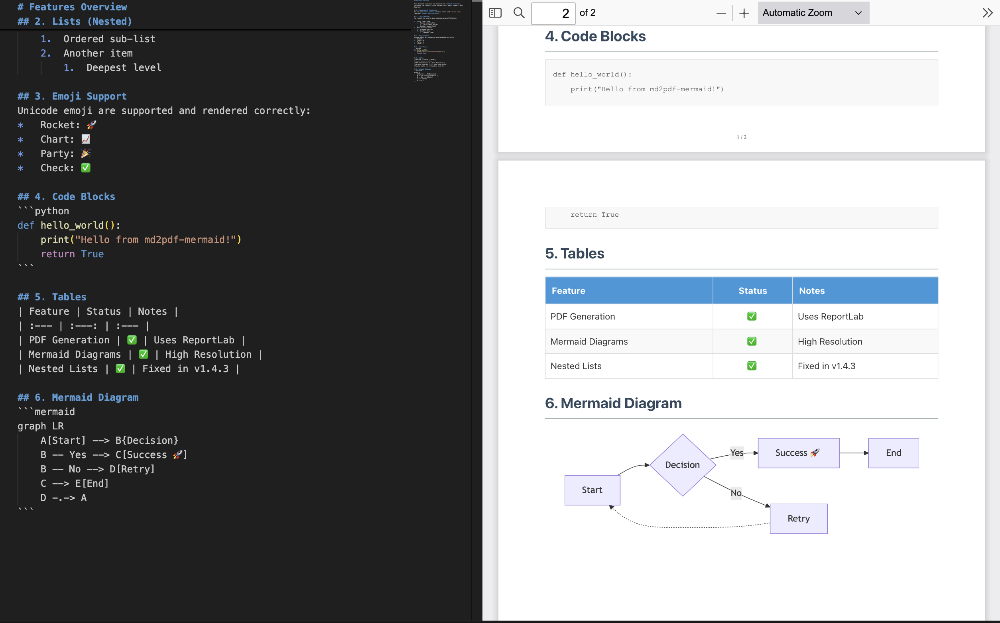

# md2pdf-mermaid

[](https://pypi.org/project/md2pdf-mermaid/)
[](https://pypi.org/project/md2pdf-mermaid/)
[](https://github.com/rbutinar/md2pdf-mermaid/blob/master/LICENSE)

<div align="center">
  <video src="https://github.com/user-attachments/assets/4de08a91-9eb6-46d5-bcfe-848ec0dca9b0" controls="controls" style="max-width: 100%;"></video>
  <br>
  <em>Watch md2pdf-mermaid in action!</em>
</div>

<div align="center">
  
</div>

**Professional Markdown to PDF converter with emoji support and automatic Mermaid diagram rendering**

Convert your Markdown documentation to beautiful PDFs with:
- ✅ **Full emoji support** 🎉 (colored, native rendering)
- ✅ **Automatic Mermaid diagram rendering** (high-quality PNG images)
- ✅ **Table of contents** generation (with `[TOC]` marker)
- ✅ **Page numbering** (automatic footer pagination)
- ✅ **Professional formatting** (headers, tables, code blocks)
- ✅ **Multiple page sizes** (A4, A3, Letter)
- ✅ **Portrait & Landscape** orientation support
- ✅ **Full Unicode/UTF-8 support** (multilingual text, special characters)
- ✅ Syntax highlighting for code blocks
- ✅ CLI and Python API
- ✅ Fast and reliable

---

## 🚀 Quick Start

### Installation

```bash
# From PyPI (recommended)
pip install md2pdf-mermaid

# Install Playwright browser (required for rendering)
playwright install chromium
```

**Alternative** - From Git repository:
```bash
pip install git+https://github.com/rbutinar/md2pdf-mermaid.git
playwright install chromium
```

**macOS Users**: Use a virtual environment (required for externally-managed Python):
```bash
python3 -m venv venv
source venv/bin/activate
pip install md2pdf-mermaid
playwright install chromium
```
See [MACOS_SETUP.md](MACOS_SETUP.md) for detailed instructions.

**WSL Users**: Use Windows Python to avoid dependency issues:
```bash
python3.exe -m venv venv  # Windows venv, no sudo needed!
venv/Scripts/pip.exe install md2pdf-mermaid
venv/Scripts/playwright.exe install chromium
```
See [WSL_SETUP.md](WSL_SETUP.md) for details.

### Command Line Usage

```bash
# Basic conversion (emoji and Mermaid just work!)
md2pdf document.md

# Custom output name
md2pdf document.md -o report.pdf

# Custom title
md2pdf document.md --title "Project Report"

# Page size and orientation
md2pdf document.md --page-size letter --orientation landscape

# High-quality Mermaid diagrams with custom theme
md2pdf document.md --mermaid-scale 3 --mermaid-theme forest

# Use legacy ReportLab engine (faster, no emoji)
md2pdf document.md --engine reportlab

# Disable Mermaid rendering (faster, text-only diagrams)
md2pdf document.md --no-mermaid

# Combine options
md2pdf document.md -o report.pdf --page-size a3 --title "Report"
```

### Python API Usage

```python
from md2pdf import convert_markdown_to_pdf_html

# Read markdown file
with open("document.md", "r") as f:
    markdown_content = f.read()

# Basic conversion (emoji supported!)
result = convert_markdown_to_pdf_html(
    markdown_content,
    "output.pdf",
    title="My Document"
)

# With custom page settings
result = convert_markdown_to_pdf_html(
    markdown_content,
    "report.pdf",
    title="Annual Report",
    page_size="A4",                # Options: 'A4', 'A3', 'Letter'
    orientation="portrait",         # Options: 'portrait', 'landscape'
    enable_mermaid=True            # Enable/disable Mermaid rendering
)

# Legacy ReportLab engine (for advanced PDF features)
from md2pdf import convert_markdown_to_pdf

convert_markdown_to_pdf(
    markdown_content,
    "output.pdf",
    page_numbers=True,
    font_name="arial",
    emoji_strategy="remove"  # ReportLab doesn't support emoji
)
```

---

## 📋 Features

### 🎨 Two Rendering Engines

#### HTML Engine (Default) - Recommended ⭐
- **Full emoji support** 🎉 - Colored emoji render natively
- **Modern CSS styling** - Browser-quality rendering
- **Table of contents** - Add `[TOC]` anywhere in your markdown
- **Page numbers** - Automatic footer pagination (X / Y format)
- **Best quality** - Superior rendering for modern documents

#### ReportLab Engine (Legacy) - For Special Cases
- **Custom fonts** - TTF font support
- **Advanced PDF features** - Custom headers/footers, bookmarks
- **Smaller file size** - Slightly more compact
- **No emoji** - Emoji are removed for compatibility

```bash
# Use HTML engine (default)
md2pdf document.md

# Use ReportLab engine
md2pdf document.md --engine reportlab --emoji-strategy remove
```

### 📝 Markdown Support

- **Headers** (H1-H4) with colored borders
- **Bold**, *italic*, `inline code` (including in lists!)
- **Emoji** 🎉 ✅ ❌ 🔴 🟢 (full color support with HTML engine)
- Bullet lists and numbered lists with **full formatting support**
- **Table of contents** - Just add `[TOC]` in your markdown!
- Tables with colored headers
- Code blocks with syntax highlighting
- Horizontal rules
- **Mermaid diagrams** (rendered as high-quality images)
- **Full Unicode/UTF-8** support (multilingual text, special characters)

### 📊 Mermaid Diagrams

Automatically renders Mermaid diagrams as high-quality PNG images:

````markdown

````

**Becomes a visual diagram in the PDF!**

**Mermaid Features:**
- **Customizable themes**: `default`, `neutral`, `dark`, `forest`, `base`
- **Quality control**: Scale factor 1-4 for resolution (default: 2 = high quality)
- **Automatic sizing**: Diagrams fit properly on pages
- **Full-width diagrams**: Optimized for readability

### 📄 PDF Styling

- Multiple page sizes: **A4**, **A3**, **Letter**
- **Portrait** and **Landscape** orientation support
- **Automatic page numbering** in footer (HTML engine)
- **Table of contents** support (HTML engine)
- Professional color scheme
- Tables with alternating row colors
- Code blocks with light gray background
- Headers with colored borders
- 2cm margins on all sides
- **Full emoji rendering** (HTML engine)

---

## 🔧 Requirements

- Python 3.8+
- Chromium browser (via Playwright, ~250 MB)
- playwright, reportlab, markdown, pillow (installed automatically)

---

## 📚 Use Cases

### 1. Technical Documentation with Emoji

Convert your modern documentation to PDF:
```markdown
# API Documentation 🚀

## Quick Start ✅

Install the package and get started! 🎉

### Features
- ✅ Easy to use
- ⚡ Fast performance
- 🔒 Secure by default
```

### 2. Architecture Diagrams

Create professional reports with:
- Data flow diagrams
- System architecture
- Process flowcharts
- Executive summaries

### 3. CI/CD Integration

Automatically generate PDFs in your pipeline:

```yaml
# GitHub Actions example
- name: Generate PDF Documentation
  run: |
    pip install md2pdf-mermaid
    playwright install chromium
    md2pdf README.md -o docs/README.pdf
```

---

## 💡 Advanced Usage

### Table of Contents

Add a table of contents anywhere in your markdown:

```markdown
# My Document

[TOC]

## Chapter 1
Content here...

## Chapter 2
More content...
```

The `[TOC]` marker will be replaced with a clickable table of contents!

### Batch Conversion

```python
from md2pdf import convert_markdown_to_pdf_html
from pathlib import Path

# Convert all markdown files
for md_file in Path("docs").glob("*.md"):
    pdf_file = md_file.with_suffix(".pdf")

    with open(md_file, "r") as f:
        content = f.read()

    convert_markdown_to_pdf_html(content, str(pdf_file), title=md_file.stem)
    print(f"✓ Created {pdf_file}")
```

### Engine Selection

```python
# HTML engine (default) - emoji support
from md2pdf import convert_markdown_to_pdf_html

result = convert_markdown_to_pdf_html(
    markdown_text,
    "output.pdf",
    enable_mermaid=True
)
# result['emoji_support'] == True

# ReportLab engine - advanced PDF features
from md2pdf import convert_markdown_to_pdf

convert_markdown_to_pdf(
    markdown_text,
    "output.pdf",
    page_numbers=True,
    font_name="arial",
    emoji_strategy="remove"
)
```

---

## 🐛 Troubleshooting

### "Playwright not found" Error

```bash
# Install Playwright
pip install playwright

# Install Chromium browser
playwright install chromium
```

### "Permission denied" When Overwriting PDF

The PDF file is open in a viewer. Close it first, then try again.

### Mermaid Diagrams Not Rendering

1. Check Playwright is installed: `python -c "import playwright"`
2. Check Chromium is installed: `playwright install --force chromium`
3. Try disabling and re-enabling Mermaid: `md2pdf file.md --no-mermaid`

### Emoji Not Rendering

If you're using the ReportLab engine, emoji are not supported. Switch to HTML engine:
```bash
md2pdf document.md --engine html  # or just: md2pdf document.md (HTML is default)
```

### macOS: "externally-managed-environment" Error

macOS uses externally-managed Python. Always use a virtual environment:

```bash
# Create and activate virtual environment
python3 -m venv venv
source venv/bin/activate

# Install package
pip install md2pdf-mermaid
playwright install chromium

# Use the package (with venv activated)
md2pdf document.md
```

**Note**: Remember to activate the virtual environment (`source venv/bin/activate`) before using md2pdf.

### WSL: "Host system is missing dependencies to run browsers"

**Best solution**: Use Windows Python instead of Linux Python (no sudo needed):

```bash
# Create Windows venv from WSL
python3.exe -m venv venv
venv/Scripts/pip.exe install md2pdf-mermaid
venv/Scripts/playwright.exe install chromium
venv/Scripts/md2pdf.exe document.md  # Works perfectly!
```

See [WSL_SETUP.md](WSL_SETUP.md) for complete instructions.

---

## 🤝 Contributing

Contributions welcome! Please:

1. Fork the repository
2. Create a feature branch
3. Make your changes
4. Add tests if applicable
5. Submit a pull request

---

## 📝 License

MIT License - see LICENSE file for details

---

## 🔗 Related Projects

- [mermaid](https://mermaid.js.org/) - Diagram syntax
- [reportlab](https://www.reportlab.com/) - PDF generation
- [playwright](https://playwright.dev/) - Browser automation
- [python-markdown](https://python-markdown.github.io/) - Markdown processing

---

## 📧 Support

- **Issues**: https://github.com/rbutinar/md2pdf-mermaid/issues
- **Documentation**: https://github.com/rbutinar/md2pdf-mermaid

---

## 🎯 Roadmap

- [x] Full emoji support (v1.4.0)
- [x] Table of contents generation (v1.4.0)
- [x] Page numbering (v1.4.0)
- [ ] Custom CSS themes
- [ ] Image embedding from URLs
- [ ] Header/footer customization
- [ ] Multi-column layouts
- [ ] PDF metadata (author, keywords, etc.)

---

**Version**: 1.4.3
**Published**: 2025-12-14
**PyPI**: https://pypi.org/project/md2pdf-mermaid/
**Status**: Stable Release 🎉

---

## 🆕 What's New

### v1.4.2 (2025-10-31) - macOS Support & Dependency Fix

**Bug Fixes:**
- 🐛 **Fixed missing dependency** - Added `markdown>=3.0.0` to all dependency configurations
  - Resolves `ModuleNotFoundError: No module named 'markdown'` on fresh installations
  - Now automatically installed with the package

**Documentation:**
- 📖 **macOS Setup Guide** - Comprehensive [MACOS_SETUP.md](MACOS_SETUP.md) documentation
  - Virtual environment setup instructions for macOS users
  - Troubleshooting for "externally-managed-environment" error
  - Tips for aliases and global installation
  - Tested on macOS 11-15 (Big Sur through Sequoia)
  - Apple Silicon (M1/M2/M3/M4) and Intel support confirmed

**Improvements:**
- ✅ Better installation experience on macOS
- ✅ Updated README with macOS-specific instructions
- ✅ All features fully tested on macOS environment

### v1.4.1 (2025-10-30)

- 🐛 Fixed Mermaid diagram rendering timing issues
- ⚡ Performance improvement: ~18% faster rendering

### v1.4.0 (2025-10-23) - Emoji Support! 🎉

**Major New Features:**
- 🎉 **Full emoji support** - Colored emoji render natively via HTML/Chromium engine
- 📑 **Table of contents** - Add `[TOC]` anywhere in your markdown for automatic TOC
- 📄 **Page numbering** - Automatic footer pagination (X / Y format)
- 🎨 **HTML rendering engine** - Superior quality, modern CSS styling (now default)
- ⚡ **Dual engine architecture** - HTML (default) or ReportLab (legacy) engines

**Technical Improvements:**
- ✅ Mermaid diagrams automatically sized to fit pages
- ✅ Better diagram quality with controlled height limits
- ✅ Professional page layout with proper margins
- ✅ Modern CSS styling for all elements
- ✅ Browser-grade rendering quality

**How to Use:**
```bash
# Emoji now work by default!
md2pdf document.md

# Table of contents
echo "[TOC]" > doc.md
md2pdf doc.md

# Legacy engine (if needed)
md2pdf document.md --engine reportlab
```

**Breaking Changes:**
- None! Default engine changed to HTML, but ReportLab still available with `--engine reportlab`

---

### v1.3.1 (2025-10-21)

- 🐛 Fixed emoji removal for technical symbols (→, ←, ✓, etc.)
- 🔧 Improved emoji detection accuracy

### v1.3.0 (2025-10-21)

- ✨ Mermaid theme support - 5 color themes available
- ✨ Mermaid quality control - Scale factor 1-4 for resolution
- ✨ Automatic emoji removal (for PDF compatibility with ReportLab)
- 🐛 Fixed Mermaid diagram sizing issues
- 🐛 Fixed hyperlink rendering

### v1.2.0 (2025-10-20)

- ✨ Full Unicode/UTF-8 support
- ✨ Customizable fonts (Arial, DejaVu, Helvetica, custom TTF)
- ✨ Bold & inline code in lists
- 🐛 Fixed encoding issues
