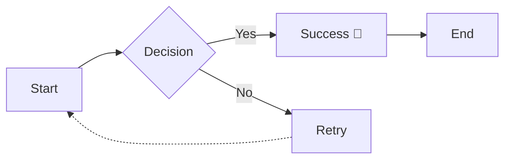

# Features Overview

This document showcases the features of **md2pdf-mermaid**, including the recently fixed nested lists, emoji support, and diagrams.

## 1. Typography & Formatting
You can use **bold text**, *italic text*, and `inline code`.
Combined: ***Bold and Italic***.

## 2. Lists (Nested)
The recent fix ensures deep nesting works effectively:

1.  First level item
    *   Second level bullet
        *   Third level bullet
    *   Another second level
2.  Back to first level
    1.  Ordered sub-list
    2.  Another item
        1.  Deepest level

## 3. Emoji Support
Unicode emoji are supported and rendered correctly:
*   Rocket: 🚀
*   Chart: 📈
*   Party: 🎉
*   Check: ✅

## 4. Code Blocks
```python
def hello_world():
    print("Hello from md2pdf-mermaid!")
    return True
```

## 5. Tables
| Feature | Status | Notes |
| :--- | :---: | :--- |
| PDF Generation | ✅ | Uses ReportLab |
| Mermaid Diagrams | ✅ | High Resolution |
| Nested Lists | ✅ | Fixed in v1.4.3 |

## 6. Mermaid Diagram

