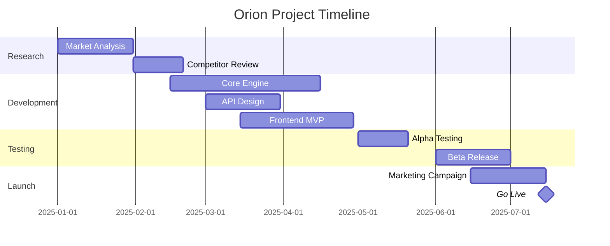

# Project Roadmap 2025

## Executive Summary
This document outlines the delivery timeline for the **Orion Project**. We are targeting a Q4 release.

## Project Timeline (Gantt)

## Key Deliverables
*   [x] Phase 1: Requirement Gathering
*   [x] Phase 2: System Design
*   [ ] Phase 3: Implementation
    *   [ ] Database Schema
    *   [ ] Auth System
*   [ ] Phase 4: User Acceptance Testing

## Resource Allocation
| Team | Role | Allocation |
| :--- | :--- | :---: |
| Backend | API Development | 100% |
| Frontend | UI/UX | 100% |
| QA | Automated Tests | 50% |
