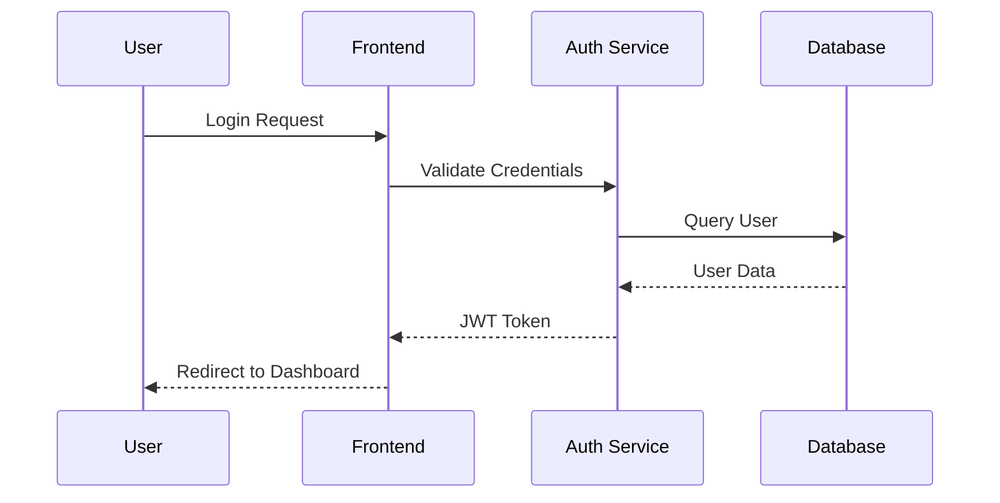
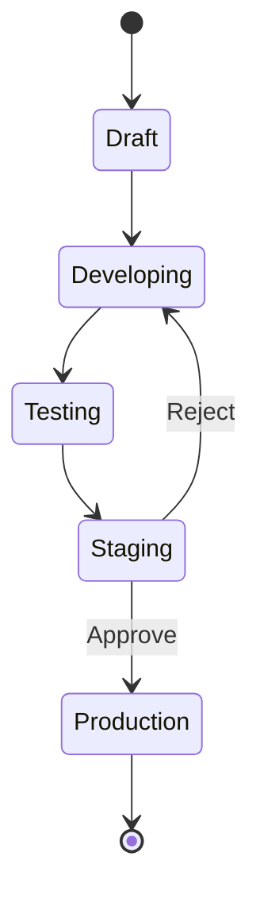
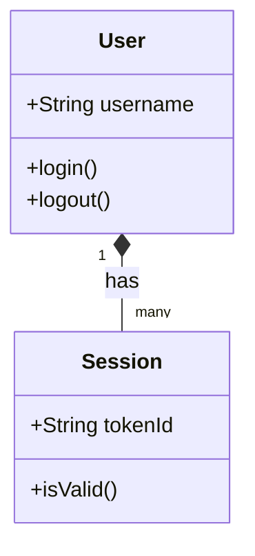

# System Architecture

## Overview
This illustrates the microservices architecture for the payment processing system.

## Authentication Flow (Sequence Diagram)

## Data Lifecycle (State Diagram)

## Component Interaction (Class Diagram)

